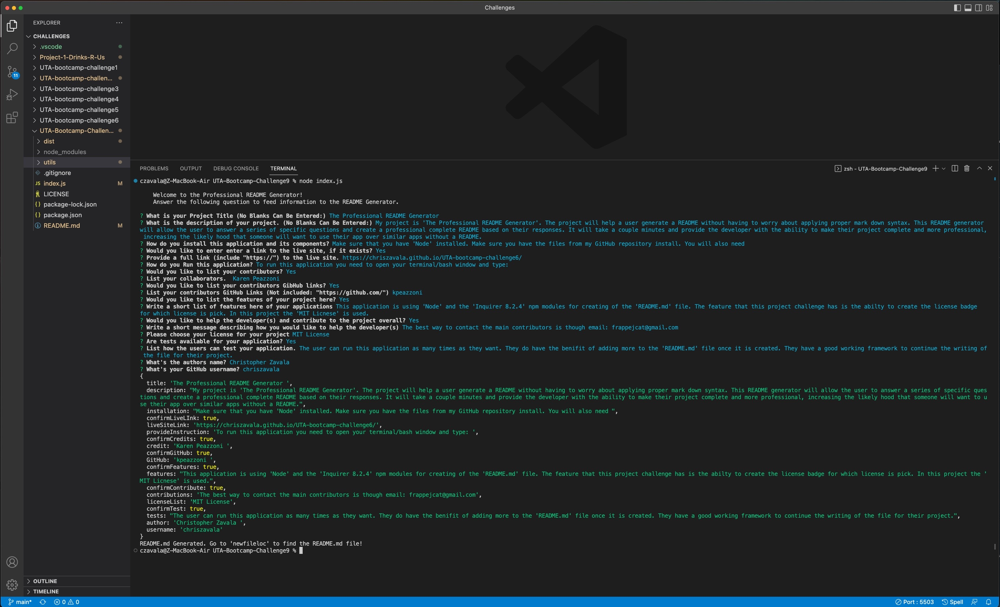
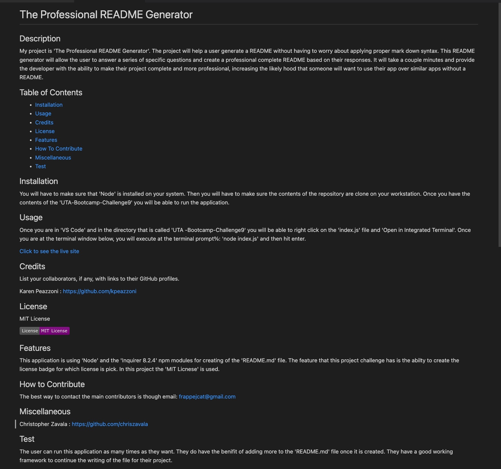
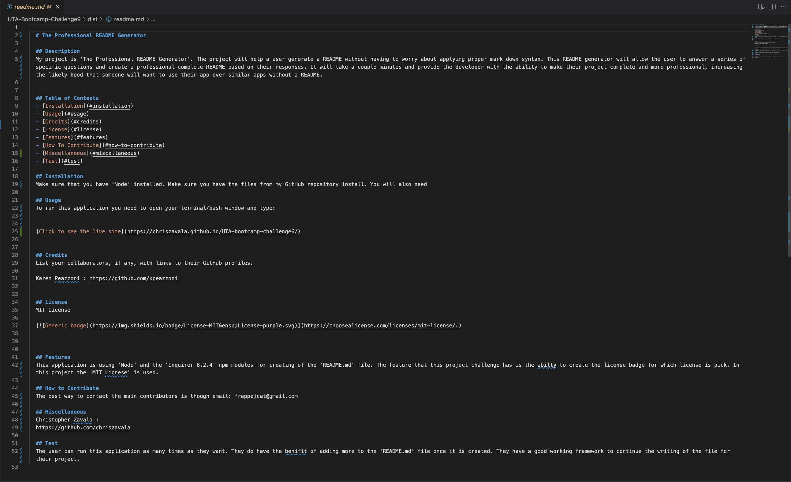

# The Professional README Generator

## Description
\
My project is 'The Professional README Generator'. The project will help a user generate a README without having to worry about applying proper mark down syntax. 

This README generator will allow the user to answer a series of specific questions and create a professional complete README based on their responses. It will take a couple minutes and provide the developer with the ability to make their project complete and more professional, increasing the likely hood that someone will want to use their app over similar apps without a README.

## Table of Contents 
\
A version of the Table of Contents will be included to show a screenshot description of what the Professional README Generator will look like. 

- [Installation](#installation)
- [Usage](#usage)
- [Credits](#credits)
- [License](#license)
- [AcceptanceCriteria](#acceptance-criteria)
- [Features](#features)
- [Tests](#tests)

## Installation
\
You will have to make sure that 'Node' is installed on your system. Then you will have to make sure the contents of the repository are clone on your workstation. Once you have the contents of the 'UTA-Bootcamp-Challenge9' you will be able to run the application.

## Usage
\
Here are screenshots that are included to show 'The Professional README Generator' application being used by a user:

 Once you are in 'VS Code' and in the directory that is called 'UTA -Bootcamp-Challenge9' you will be able to right click on the 'index.js' file and 'Open in Integrated Terminal'. Once you are at the terminal window below, you will execute at the terminal prompt%: 'node index.js' and then hit enter. 

The application will be invoked by using the following command:

```bash
node index.js
```
You will then be greeted with a 'Welcome to theProfessional README Generator" and you can begin by answering all the applicable questions. Once the question and answers are complete a 'readme.md' file will be generated in the 'dist' folder. You will now have access to a very professional looking 'README.md' file that can be attached to your development project. 

## Credits
\
List your collaborators: 
\
Josh Goeke: https://github.com/joshuagoeke \
Karen Peazzoni: https://github.com/kpeazzoni \
Christopher Zavala: https://github.com/chriszavala 

## License
\
MIT License rights are used for this open source project. \
[](https://choosealicense.com/licenses/mit-license/.)

## Acceptance Criteria
\
GIVEN a command-line application that accepts user input
WHEN I am prompted for information about my application repository
THEN a high-quality, professional README.md is generated with the title of my project and sections entitled Description, Table of Contents, Installation, Usage, License, Contributing, Tests, and Questions
WHEN I enter my project title
THEN this is displayed as the title of the README
WHEN I enter a description, installation instructions, usage information, contribution guidelines, and test instructions
THEN this information is added to the sections of the README entitled Description, Installation, Usage, Contributing, and Tests
WHEN I choose a license for my application from a list of options
THEN a badge for that license is added near the top of the README and a notice is added to the section of the README entitled License that explains which license the application is covered under
WHEN I enter my GitHub username
THEN this is added to the section of the README entitled Questions, with a link to my GitHub profile
WHEN I enter my email address
THEN this is added to the section of the README entitled Questions, with instructions on how to reach me with additional questions
WHEN I click on the links in the Table of Contents
THEN I am taken to the corresponding section of the README

## Features
\
This application is using 'Node' and the 'Inquirer 8.2.4' npm modules for creating of the 'README.md' file. The feature that this project challenge has is the abilty to create the license badge for which license is pick. In this project the 'MIT Licnese' is used.

## Tests
The user can run this generator as many times as they want. They will be at the very least be able to create a template for the 'READme.md' file for any future projects or challenges.

### Video Link inserted here:

https://drive.google.com/file/d/1l5RaNfSz1gwlbmMtF5c6s18_PkQ-qKxf/view


### Screenshots:




